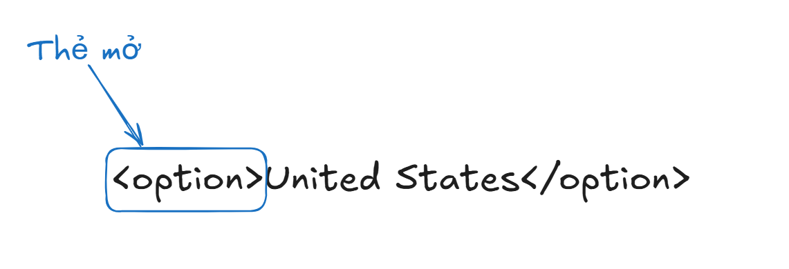

# Javascript (Functions Advance)

## Function Expression

- Định nghĩa function bằng cách `gán nó cho một biến`

````javascript
// Function Declaration (khai báo hàm)
function add(a, b) {
    return a + b;
}

// Function Expression (biểu thức hàm)
const add = function(a, b) {
    return a + b;
};

// So sánh cách gọi
console.log(add(2, 3)); // 5 - cả hai đều giống nhau
````

- Ví dụ 1:

    - Khai báo hàm có tham số name. Trả về chuỗi Hello `<name>`


- Ví dụ 2: 

    - Khai báo hàm có tham số price, quantity, discount. Trả về giá trị, biết giá trị = price * quantity - discount


## Lambda Function

- Lambda function (còn gọi là Arrow Function)

- Xuất hiện lần đầu trong ES6 (ES2015).

- Đây là cách viết ngắn gọn hơn cho function

- Sử dụng dấu =>

````javascript
// Function truyền thống
function add(a, b) {
    return a + b;
}

// Function expression
const add = function(a, b) {
    return a + b;
};

// Arrow function (Lambda)
const add = (a, b) => {
    return a + b;
};
````

- Ví dụ 1:

    - Khai báo hàm có tham số name. Trả về chuỗi Hello `<name>`


- Ví dụ 2: 

    - Khai báo hàm có tham số price, quantity, discount. Trả về giá trị, biết giá trị = price * quantity - discount


- **Một số cách viết khác:**

1. Nếu chỉ có 1 dòng code => có thể “rút gọn” cặp ngoặc nhọn

````javascript
// Cú pháp ngắn gọn nhất (implicit return)
const add = (a, b) => a + b;
````

2. Không có tham số

````javascript
// Phải có dấu ngoặc tròn rỗng
const greet = () => console.log("Hello!");
const getRandom = () => Math.random();
````

3. Một tham số

````javascript
// Có thể bỏ dấu ngoặc tròn
const double = x => x * 2;
const square = x => x * x;

// Hoặc giữ dấu ngoặc (tùy style)
const triple = (x) => x * 3;
````

- Ví dụ 1:

    - Khai báo hàm có tham số name. Trả về chuỗi Hello `<name>`


- Ví dụ 2: 

    - Khai báo hàm có tham số price, quantity, discount. Trả về giá trị, biết giá trị = price * quantity - discount 


## Anonymous function

- Hàm ẩn danh

- function `không có tên`.

- được sử dụng khi function `chỉ cần dùng một lần` hoặc `làm callback`.

````javascript
// Named function (có tên)
function namedFunction() {
    console.log("I have a name!");
}

// Anonymous function (không tên)
function() { // SyntaxError! Không thể đứng một mình
    console.log("I'm anonymous!");
}

// Anonymous function phải được sử dụng ngay
// 1. Gán cho biến
const anonymousFunc = function() {
    console.log("I'm anonymous but stored in a variable!");
};

// 2. Dùng làm callback
setTimeout(function() {
    console.log("Anonymous callback!");
}, 1000);
````
# DOM

- Khi vào một [website](https://betterbytes.edu.vn/), ta nhìn thấy website dưới dạng:

    - Các khối text

    - Các hình ảnh

    - Các liên kết

    - Các ô input


- Máy tính sẽ “nhìn” ở dưới dạng “cây có cấu trúc”
    - Mở cây này bằng cách bấm `phím F12` (hoặc chuột phải vào vùng trống, chọn “Inspect”); sau đó chọn tab `“Element”`

    - Cấu trúc này gọi là `DOM` (Document Object Model)

    - Ví dụ:


- **Node**

````html
<option>United States</option>
````
- Một element sẽ có dạng như trên `<option>United States</option>`




## Các thẻ HTML thường gặp

- Trên thực tế, có rất nhiều loại thẻ khác nhau:

- Thẻ tiêu chuẩn: thẻ do tổ chức uy tín mozilla định nghĩa

- Thẻ tự định nghĩa: do lập trình viên/ website tự định nghĩa

- **Các thẻ tiêu chuẩn thường gặp**

1. Thẻ Cấu Trúc Cơ Bản

````html
<html>: Thẻ gốc của trang

<head>: Chứa metadata: tiêu đề website, hiển thị Google

<body>: Nội dung của cả website hiển thị

<div>: Khối/container chung

<span>: Inline container

<header>, <footer>, <nav>, <section>: Thẻ ngữ nghĩa
````

2. Thẻ Nội Dung:

````html
<h1> đến <h6>: Tiêu đề

<p>: Đoạn văn

<a>: Liên kết

: Hình ảnh

<ul>, <ol>, <li>: Danh sách
````

3. Thẻ Form (Quan trọng cho Testing):

````html
<form>: Biểu mẫu

<input>: Ô nhập liệu (text, password, checkbox, radio, etc.)

<button>: Nút bấm

<select> và <option>: Dropdown

<textarea>: Vùng văn bản nhiều dòng
````

- Demo tất tần tật các thẻ:

[https://material.playwrightvn.com/035-DOM-elements.html](https://material.playwrightvn.com/035-DOM-elements.html)

# Selector

- Automation = tương tác với các phần tử trên trang web

1.  **Input**


2. **Fill**

3. **Click**

4. ...

- Để tương tác được, ta cần `tìm` được phần tử này

- Selector là công cụ giúp ta `tìm`

- Có 3 loại selector thường dùng:

    - **XPath**
        - Dùng được trong hầu hết các trường hợp (99.99%)

        - Đa dạng, có khả năng tìm các phần tử khó

        - Hơi dài

        - VD: `//button[normalize-space() = ‘Add to cart’]`

    - **CSS selector**
        - Ngắn gọn, performance cao

        - Dùng cho các trường hợp dễ tìm.

        - Không linh hoạt bằng XPath

        - VD: `.add-to-cart`

    - **Playwright selector**

        - Chỉ dùng riêng cho Playwright

        - Cú pháp ngắn gọn, không phụ thuộc vào cấu trúc DOM

        - Hướng tới “giống người dùng đang nhìn thấy gì”

        - VD: `page.getByText(“Add to cart”);`

- Khi nào thì dùng gì? `Playwright selector > CSS Selector > XPath`

    - Vẫn cần học hiểu cả ba loại để có thể “cân” được mọi loại dự án.

    - Có những dự án “thích” dùng CSS, “thích” dùng XPath, ta buộc phải tuân theo.

### **XPath selector**

- XPath = XML Path

- Có 2 loại:

1. **Tuyệt đối**: đi dọc theo cây DOM

    - bắt đầu bởi 1 /


2. **Tương đối**: tìm dựa vào đặc tính

    - bắt đầu bởi 2 //

    - `//tenthe[@thuoctinh=”giatri”]`


- Nên dùng XPath tương đối

# Playwright basic syntax

- học cách `tương tác` với các phần tử

    - Viết một test

    - Tổ chức thành các step

    - Tương tác cơ bản

        - Navigation

        - Click

        - Fill

1. **test**: 

- Đơn vị cơ bản để khai báo một test

````javascript
import { test } from '@playwright/test';

test('<tên test>', async ({ page }) => {
    // Code của test
});
````


2. **step**: 

- Đơn vị nhỏ hơn test, để khai báo từng step của test case

````javascript
await test.step('Tên step', async () => {
    // Code here
});
````

````javascript
test('<tên test>', async ({ page }) => {
    await test.step('Tên step', async () => {
        // Code here
    });
});
````


- **Lưu ý**: step nên được map 1-1 với test case để dễ dàng maintain.


3. **navigate**: 

- để chỉ việc chuyển hướng (đi đến) một URL cụ thể trong trình duyệt.

    - `page` : là đối tượng trang (Page object) mà Playwright mở ra.

    - `goto(url)` : tải trang web theo URL chỉ định.

````javascript
await page.goto('https://pw-practice.playwrightvn.com/');
````


4. **Locate**: 

- tìm phần tử trên trang web để thao tác (click, fill, get text, v.v.).

- Sử dụng `page.locator(“<selector>”)` để chọn phần tử trên trang

- VD: 

````javascript
page.locator(“//input[@id=’email’]”)
````

### **click**

- là hành động nhấp chuột vào một phần tử đã được định vị bằng locator.

- Single click

````javascript
await page.locator("//button").click();
````


- Double click

````javascript
await page.locator("//button").dblclick();
````

- Click chuột phải

````javascript
page.locator("//button").click({
    button: 'right'
})
````

- Click chuột kèm bấm phím khác

````javascript
page.locator("").click({
    modifiers: ['Shift'],
})
````

### **Input**

1. Fill

- Giống việc bạn `paste content` vào một ô input

````javascript
page.locator("//input").fill('Playwright Viet Nam');
````

2. pressSequentially

- Giống việc bạn `gõ từng chữ cái` vào ô input

````javascript
page.locator("//input").pressSequentially('Playwright Viet Nam', {delay: 100,});
````


### **Radio/checkbox**

1. Lấy giá trị hiện tại đang là check hay không:

````javascript
const isChecked =
page.locator("//input").isChecked();
````

2. Check/ uncheck

````javascript
page.locator("//input").check();
page.locator("//input").setChecked(false);
````


### **Select**

````javascript
await page.locator('//select[@id=”country”]').selectOption({ label: 'USA' })
````


### **Upload file**

````javascript
await page.locator("//input[@id='profile']").setInputFiles("<file-path>");
````


